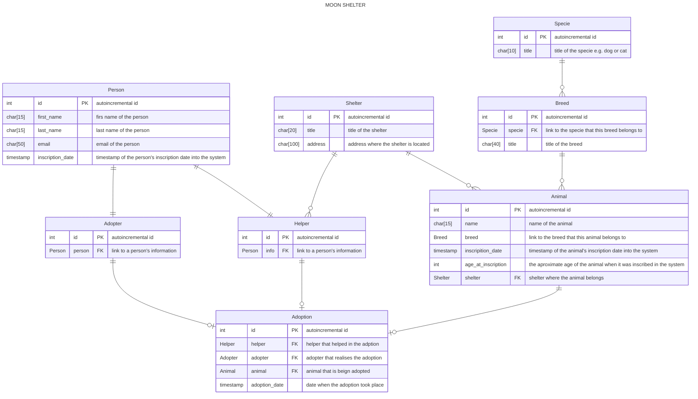

# MOON SHELTER

## DEMO

## DOCUMENTATION

### Entity Relation Diagram

### Sequence Diagrams

# TECHNICAL TEST REQUIREMENTS

## Creación de un API REST con Django Rest Framework y un client web con React

La prueba consiste en crear un API REST para un único recurso, la cual será consumida desde un cliente web. La generación de todos los archivos necesarios y el manejo de una óptima estructura de archivos debe ser realizado por el/la postulante. Genere un fork de este repositorio. Utilice versiones con sporte de Python, Django y React.

## Requerimientos generales

1. El API REST debe ser desarrollado con Django Rest Framework.
2. El cliente web debe ser desarrollado con React + Typescript.
3. El cliente web debe consumir el API REST.
4. Se debe utilizar el ORM de Django para el modelo de la base de datos.
5. Se debe crear un archivo `requirements.txt` con las dependencias necesarias para ejecutar el proyecto.
6. Se debe crear un archivo `README.md` en el cual se explique el funcionamiento del proyecto, así como las instrucciones para ejecutarlo.
7. Se debe crear un archivo `.env` que contenga las variables de entorno necesarias para la ejecución del proyecto.
8. Se debe crear un archivo `.gitignore` que ignore los archivos y carpetas innecesarias para la ejecución del proyecto.

## Requerimientos backend

1. Generar un endpoint para administrar un albergue de animales rescatados (perros y gatos). Se debe poder llevar un control de los animales en albergue: nombre, edad, raza, tipo (perro o gato), estado (adoptado, en adopción, en espera de adopción, etc). Se debe poder llevar un control de los voluntarios que trabajan en el albergue: nombre, apellido, correo electrónico, contraseña, estado (activo, inactivo, etc). Se debe poder llevar un control de las personas que adoptan animales: nombre, apellido, correo electrónico, contraseña, estado (activo, inactivo, etc). Se debe poder llevar un control de las adopciones, es decir, el registro de cuándo y a quién se le entregó un animal: fecha, animal, voluntario, persona que adopta, estado (finalizado, en proceso, etc).

   **Nota:** El endpoint debe permitir realizar las siguientes operaciones:

   - Listar todos los animales en albergue.
   - Listar todos los voluntarios.
   - Listar todos los adoptantes.
   - Listar todas las adopciones.
   - Crear un animal en albergue.
   - Crear un voluntario.
   - Crear un adoptante.
   - Crear una adopción.
   - Obtener un animal en albergue.
   - Obtener un voluntario.
   - Obtener un adoptante.
   - Obtener una adopción.
   - Actualizar un animal en albergue.
   - Actualizar un voluntario.
   - Actualizar un adoptante.
   - Actualizar una adopción.
   - Eliminar un animal en albergue.
   - Eliminar un voluntario.
   - Eliminar un adoptante.
   - Eliminar una adopción.

2. El modelo de la base de datos queda a elección del postulante; sin embargo, esta debe tener todo lo necesario para plasmar lo explicado en el requerimiento anterior.

3. Se desea validar que los datos recibidos via POST request cumplan las restricciones establecidas en el modelo de la base de datos. Los errores deben mostrarse al usuario en el response.

4. Se desea que el API sea restringido mediante algún método de autenticación. Queda a elección del postulante el approach de autenticación a seguir. El nivel de seguridad será evaluado.

5. Se desea que el usuario se autentifique mediante json web tokens, para ello se utilizará la librería Simple JWT para Django rest framework.

## Requerimientos frontend

1. Debe utilizar React + Typescript junto al framework [Mantine UI](https://mantine.dev/).

2. Debe contar con un solo registro para los voluntarios y adoptantes. Los administradores (superusers) solo pueden ser creados desde Django admin. Para terminos prácticos puede asumir que los roles son excluyentes.

3. Debe contar con un Login unificado para los voluntarios, adoptantes y administradores.

4. Los administradores pueden acceder al CRUD de los animales en albergue, de los voluntarios, de los adoptantes y de las adopciones.

5. Los adoptantes solo pueden visualizar los animales disponibles para adopción y solicitar la adopción de un animal.
6. Los voluntarios pueden visualizar los animales del albergue, los adoptantes y las adopciones. Además, pueden cambiar el estado de un animal en albergue a "adoptado" o "en adopción".

## Adicionales

1. Deployar el cliente web y servidor backend en la capa gratuita de algún servicio cloud.
2. Realizar proceso de quality assurance con SonarCloud, recuerde que para ello este repositorio debe manteneser público. (Adjuntar link del reporte obtenido)

# Objetivos de la prueba

- Evaluar el conocimiento general del lenguaje Python y de React.
- Evaluar el conocimiento en arquitecturas web (MVC, REST).
- Comprobar el conocimiento independientemente de la herramienta / framework.
- Evaluar buenas prácticas en el código relacionadas con Python (pep8).
- Evaluar conocimientos de frontend.
- Evaluar el modelo mental que se tiene para la organización de classes, funciones, módulos.
- Evaluar el conocimiento de buenas prácticas de desarrollo de software.
- Evaluar el conocimiento de buenas prácticas de seguridad.
- Evaluar el conocimiento de testing.
